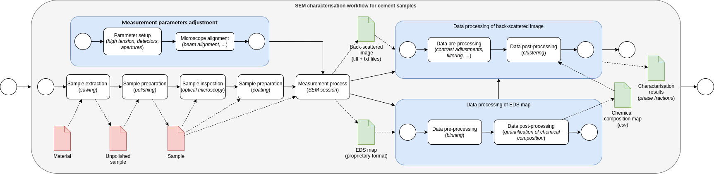
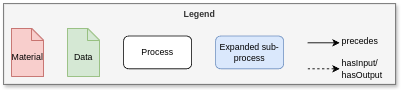

# Documenting a CHADA workflow






## Setting up the graph database

### Setup of python environment

Create a virtual Python environment for this demo and activate it.
Make sure that you are in the folder where you want your environment.

    # choose your desired environment name
    envname=pinkdemo  # Linux
    $envname = "pinkdemo"  # Windows PowerShell
    python3.X -m venv ${envname}  # you probably have to choose python version
    source ${envname}/bin/activate  # Linux
    ".\${envname}\Scripts\activate.bat" # Windows PowerShell
    pip install ipython  # If you want to use ipython

Install tripper

    pip install -U pip
    pip install "tripper[datadoc] @ git+https://github.com/EMMC-ASBL/tripper.git@master"

For handling of username and password

    pip install keyring
    # This is the simplest cross-platform keyring, more secure version exist
    pip install keyrings.alt

NB! In Windows Powershell you will get an error as the folder with the
scripts is not in the PATH.  You can fix this in the current session
as shown below.  Note that the first ';' is crucial

    $env:Path += ';C:\path\displayed\in\the\warning'

The development version of tripper from the `master` branch together
with extra dependencies for data documentation is now installed.

Clone the DataDocumentation folder to where you want.

    git clone git@github.com:HEU-MatCHMaker/DataDocumentation.git
    cd DataDocumentation/examples/CHADA-workflow


### Prepare your local triplestore

For demonstration and easy testing purposes it is useful to set up a
local triplestore on your machine.  Choice of triplestore is up to
you, but we suggest fuseki which can be set up as follows:

```bash
docker pull stain/jena-fuseki
docker run -d --name fuseki -p 3030:3030 -e ADMIN_PASSWORD=admin0 \
  -e=FUSEKI_DATASET_1=test_repo stain/jena-fuseki
```

Since adding the password everytime is timeconsuming you can create a
configuration file for tripper.
Create a file in ~/.config/tripper/session.yaml with the following content:

```yaml
FusekiTest:
  backend: sparqlwrapper
  base_iri: http://localhost:3030/test_repo
  update_iri: http://localhost:3030/test_repo/update
  username: admin
  password: admin0
```

You are now ready to populate and search your knowledge base.

## Populate your triplestore

First we can check that the triplestore is empty:

Now add the ....
